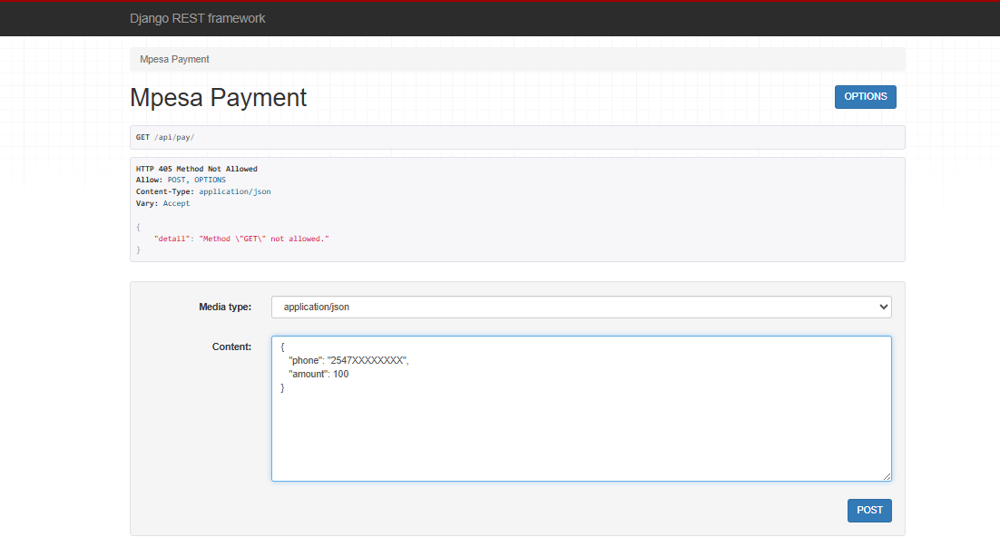

# README.yaml

title: Django E-commerce M-Pesa API

description: |
  ## Overview
  Django E-commerce M-Pesa API is a backend solution for e-commerce platforms, built with Django and Django REST Framework. It enables seamless integration with M-Pesa mobile payments, providing secure endpoints for payment processing, token management, and callback handling.

features:
  - **M-Pesa Payment Integration:** Lipa na M-Pesa Online support.
  - **RESTful API Endpoints:** For payment initiation and token management.
  - **Callback Handling:** Secure endpoint for M-Pesa payment notifications.
  - **Environment Configuration:** Easy setup with `.env` files.
  - **CORS Support:** For frontend-backend integration.
  - **SQLite Database:** Default for development.

requirements:
  - **Python:** 3.10+
  - **Django:** 5.1.7
  - **djangorestframework**
  - **django-cors-headers**
  - **django-daraja**
  - **python-dotenv**

setup: |
  ## Getting Started

  1. **Clone the repository**
     ```
     git clone <repo-url>
     cd django_eccomerce
     ```
  2. **Create and activate a virtual environment**
     ```
     python -m venv venv
     venv\Scripts\activate
     ```
  3. **Install dependencies**
     ```
     pip install -r 
     ```
  4. **Configure environment variables**  
     Create a `.env` file and add your M-Pesa credentials.
  5. **Run migrations**
     ```
     python  migrate
     ```
  6. **Start the development server**
     ```
     python  runserver
     ```

environment_variables: |
  ## Environment Variables

  - `MPESA_ENVIRONMENT`
  - `MPESA_CONSUMER_KEY`
  - `MPESA_CONSUMER_SECRET`
  - `MPESA_SHORTCODE`
  - `MPESA_PASSKEY`
  - `MPESA_SHORTCODE_TYPE`

api_endpoints: |
  ## API Endpoints

  - **POST** `/api/token/` - Obtain M-Pesa access token
  - **POST** `/api/payment/` - Initiate M-Pesa payment
  - **POST** `/api/callback/` - Handle M-Pesa payment callback


  ## Screenshot



